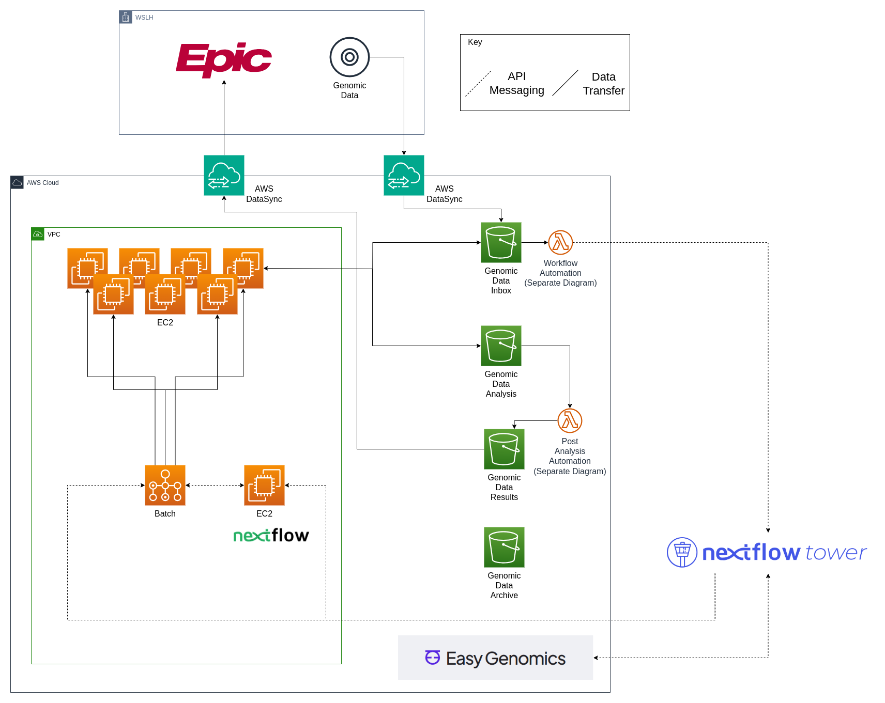

# aws-infra-nextflow

Terraform configuration for managing infrastructure responsible for running Nextflow workflows utilizing AWS Batch.

#### Infrastructure Diagram

### Setup Notes
The tfvars file is intentionally omitted from this repository so variables will need to be defined at the command line or in an input variable file. Additionally, this repo is configured to use S3 in combination with dynamodb to manage the state and lock status, you will need to change the backend configuration to match your own settings.

### File List
| File Name | Description |
| --- | --- |
| (dev/prod)-backend.conf | configurations for managing terraform state |
| main.tf | terraform configuration |
| launchTemplateReset.sh | bash script used for deleting AWS Batch queues and compute environments, useful if changes are needed in the launch configuration template since the templates are generated when ECS is created, which only happens when a new queue is created |
| nextflow-cloudwatch-config.json | cloudwatch configuration used by the amazon-cloudwatch-agent to send Nextflow logs to cloudwatch |
| NextflowEC2launchTemplate.tftpl | EC2 launch template to install Nextflow dependencies on EC2 prior to accepting jobs from AWS Batch |
| variables.tf | variables needed by terraform for configuration of the environment |

### Terraform Variables
| Variable | Description | Type | Example |
|---|---|---|---|
| env_prefix | This is the account environment prefix, used in tags | string | "dev" |
| owner | The owner of the project, used in tags | string | "AAA" |
| region | The AWS region where infrastructure will be deployed | string | "us-east-1"
| project | The project name, used for tags and resource names | string | "nextflow" |
| nextflow_subnet_tier | 'Tier' tag value of subnet where ec2 instances are running nextflow jobs | string | "Private" |
| nextflow_security_group | Name of security group to apply to ec2 instances running nextflow jobs | string | "Nextflow SG" |
| buckets | List of S3 bucket names that nextflow jobs will need access | list of strings | ["Bucket1","Bucket2"] |
| external_buckets | List of external S3 bucket names that nextflow jobs need access to | list of strings | ["External-Bucket1"] |
| job_compute_family | List of compute instance families to use for nextflow workflow jobs | list of strings | ["c4","c5"] |
| head_compute_family | List of compute instance families to use for the nextflow engine process | list of strings | ["c5"] |
| max_job_cpus | Maximum allowed virtual CPUs for all simultaneous nextflow jobs in the compute environment | integer | 128 |
| max_head_cpus | Maximum allowed virtual CPUs for all simultaneous nextflow engine processes in the compute environment | integer | 16 |
| aws_nextflow_user | The programmatic IAM user that has roles to access AWS Batch | string | "prog-access-nextflow" |
| nextflow_vpc_name | Name of VPC where nextflow jobs are to be provisioned | string | "AWS VPC" |
| nextflow_ec2_ami | The AMI or Amazon Machine Image to use for ec2 instances running nextflow jobs, must be an Amazon ECS-Optimized image | string | "ami-0017b31c3b5cc98fb" |